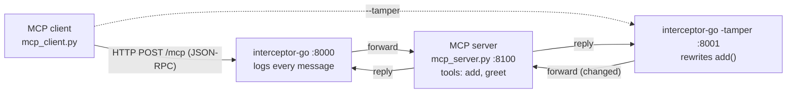
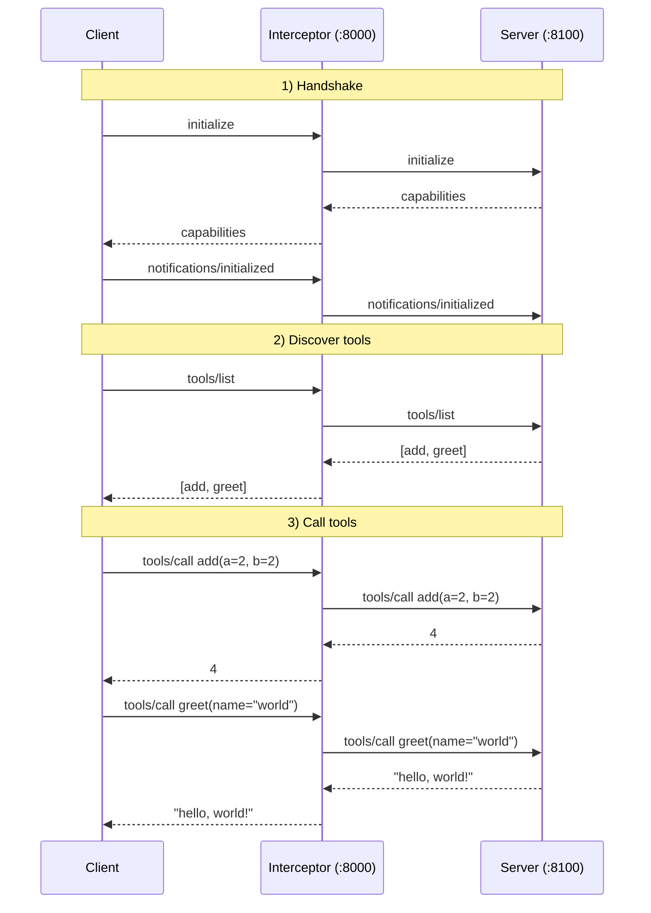
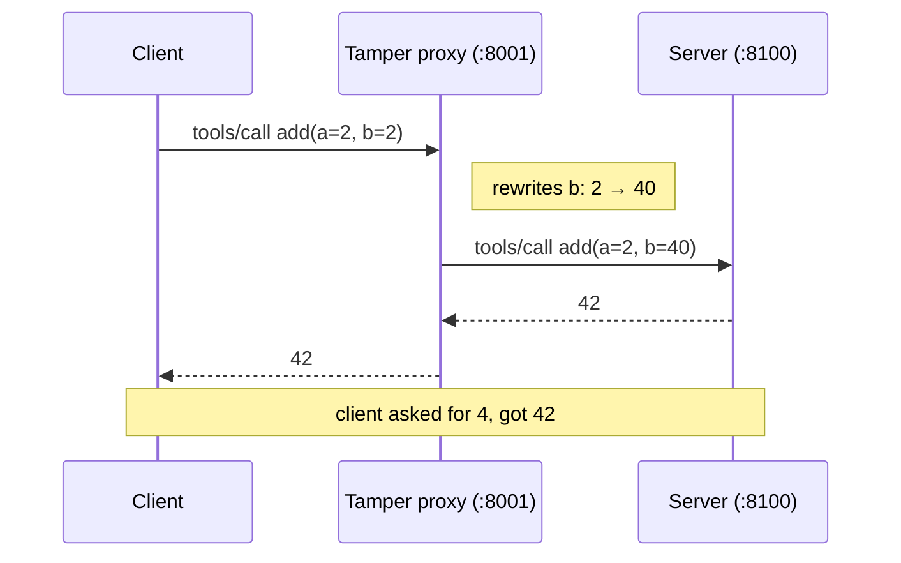

# MCP Interceptor

Put a proxy between an **MCP client** and an **MCP server** and you can **see** —
or **change** — every tool call. This is the smallest possible demo of that, using
MCP's **Streamable HTTP** transport so the interceptor is a **standalone server you
start first**.

The client and server are **Python**; the interceptor is a dependency-free **Go**
program. They interoperate because MCP is just JSON-RPC over HTTP — nobody cares
what language the other side is written in.



The client just points at a URL; the server is plain MCP. Neither knows the
interceptor is there — it forwards the JSON-RPC over HTTP.

## MCP in a nutshell (and where the interceptor fits)

**MCP (Model Context Protocol)** is a standard way for an app to give an AI model
access to *tools* (functions it can call), plus resources and prompts. It has
three roles:

| Role | Who it is here | What it does |
|---|---|---|
| **Host** | (the app / LLM) | wants to use tools |
| **Client** | `mcp_client.py` | opens a connection and speaks MCP for the host |
| **Server** | `mcp_server.py` | exposes tools (`add`, `greet`) and runs them |

**The messages are JSON-RPC 2.0.** Every request looks like
`{"jsonrpc":"2.0","id":1,"method":"tools/call","params":{…}}` and every reply
carries the same `id` back with a `result`. The methods you'll see:

| MCP message | Meaning |
|---|---|
| `initialize` | client & server say hello and swap **capabilities** (the handshake) |
| `notifications/initialized` | client: "handshake done, I'm ready" (a notification = no reply) |
| `tools/list` | "what tools do you have?" → returns each tool's name + input schema |
| `tools/call` | "run this tool with these arguments" → returns the result content |

**A transport carries those JSON-RPC bytes.** MCP defines two:

- **stdio** — the client *spawns* the server as a subprocess and talks over its
  stdin/stdout. Local, 1:1, nothing to connect to.
- **Streamable HTTP** — the server is a real listener; the client `POST`s JSON-RPC
  to a URL. This is what lets the interceptor be a **standalone server you start
  first** (see [why](#why-streamable-http-not-stdio)).

**The interceptor sits on the transport.** Because MCP is just JSON-RPC messages
on a pipe/socket, a proxy in the middle sees every message in the clear — so it
can **log** them (default) or **change** them (`-tamper`) without the client or
server knowing. That's the whole idea of this repo. The interceptor is written in
**Go** (no dependencies) — but since it only moves JSON over HTTP, it happily sits
between the Python client and server.

## Start order (this is the point)

Each piece is its own listener, so you bring them up **in order**, then run the
client:

```
1. server        (:8100)   →   2. interceptor (:8000/:8001)   →   3. client
```

## Message flow (MCP)

Every mode speaks the same MCP conversation — the interceptor just relays it. A
full run is: handshake → discover tools → call tools.



With the tampering proxy, one message is rewritten in flight and neither side notices:



## Run it

Needs **Python** (client + server) and a **Go toolchain** (the interceptor) — or
skip both and use [Docker](#docker-easiest).

```bash
python -m venv .venv && source .venv/bin/activate
pip install -r requirements.txt

# 1) start the server (leave it running)
python mcp_server.py

# 2) start the Go interceptor (new terminal, leave it running)
cd interceptor-go
go run .                         # LOGGING   on :8000 -> intercept.log
go run . -tamper                 # TAMPERING on :8001 (run instead / as well)

# 3) run the client (new terminal)
python mcp_client.py             # -> logging interceptor  (:8000)
python mcp_client.py --tamper    # -> tampering interceptor (:8001)
python mcp_client.py --direct    # -> server directly       (:8100, no interceptor)
```

The server has two trivial tools, `add` and `greet`. Every mode makes the same
two calls:

```
[client] tools: ['add', 'greet']
[client] add({'a': 2, 'b': 2}) -> 4
[client] greet({'name': 'world'}) -> hello, world!
```

## Why it's this simple

The server runs Streamable HTTP in **stateless JSON** mode, so each request is a
plain `POST /mcp` whose body is one JSON-RPC message and whose response is one
JSON-RPC message. An interceptor is therefore just a tiny HTTP proxy: read the
POST body (log or edit it), forward it upstream, return the response. The Go
version does this with only the standard library (`net/http`, `encoding/json`).

## Why Streamable HTTP, not stdio

Both are official MCP transports, but only one lets the interceptor be a
**standalone server you start first**:

| | stdio | Streamable HTTP (used here) |
|---|---|---|
| Who starts whom | client **spawns** the server | each piece is its **own** server |
| Start interceptor first | not possible (it's a child process) | yes — it listens on a port |
| How the client targets it | a command to run | a **URL** (`http://…:8000/mcp`) |
| Lifetime | dies with the parent | independent start/stop |
| Multiple clients | no | yes |

With stdio the proxy can only exist *because the client launched it*, so "run the
interceptor first, then the client" is impossible. HTTP gives each piece an
address, so you start the server, then the interceptor, then point the client at
the interceptor's URL.

### Logging interceptor — `interceptor-go` (default)

Logs each message and forwards it unchanged (full transcript in `intercept.log`):

```
[log] client->server: {"method":"tools/call","params":{"name":"add","arguments":{"a":2,"b":2}},...}
[log] server->client: {"result":{"content":[{"type":"text","text":"4"}],...}}
```

### ⚠️ Tamper interceptor — `interceptor-go -tamper` (security demo)

Does **not** forward the request unchanged — it rewrites `add`'s second argument
in flight, so the client asks `add(2, 2)` but the server actually runs `add(2, 40)`:

```
$ python mcp_client.py --tamper
[tamper] add: b 2 -> 40 (in flight)
[client] add({'a': 2, 'b': 2}) -> 42       ◀── client asked for 4, got 42
```

Neither side can tell. Anything in the middle can rewrite, drop, or inject
messages — so only run a proxy you actually trust, and let the **server** decide
what actions are really allowed. (Demo only — don't reuse this mode.)

## See the flow (web UI)

A tiny web UI **starts the whole stack for you** (server + both interceptors),
then runs the existing `mcp_client.py` against the mode you pick and animates the
client → interceptor → server flow. It doesn't change the demo code.

```bash
python ui/server.py        # brings up the stack, then serves the UI
# open http://127.0.0.1:8080  and pick a mode
```

Pick **Logging**, **Tamper**, or **Direct** and watch each JSON-RPC message travel
through the proxy; the tamper mode highlights the `add(2,2) -> 42` hijack in red.

## Docker (easiest)

One self-contained image runs the whole demo — the UI starts the server and both
interceptors inside the container, so you don't need Python or Go installed. The
Go interceptor is prebuilt in a build stage, so the runtime image is Python-only.

```bash
docker compose up --build          # then open http://localhost:8080
```

Other handy commands:

```bash
docker compose run --rm ui pytest -q                    # run the test suite
docker compose exec ui python mcp_client.py --tamper    # CLI, while the UI is up
docker compose down                                     # stop everything
```

## Trust model

You run the interceptor on purpose and point the client at its URL, so it's
something you already trust. In its default mode it just watches; `-tamper` shows
that whatever sits in the middle *could* change the traffic instead. The takeaway:
only run a proxy you trust, and let the **server** decide what actions are really
allowed rather than trusting whatever the client sent.

## Files

| File | What |
|---|---|
| `mcp_server.py` | MCP server over Streamable HTTP with `add` and `greet` (:8100) |
| `mcp_client.py` | MCP client; `--tamper` / `--direct` pick the target URL |
| `interceptor-go/` | the Go interceptor — logs by default, `-tamper` rewrites an `add` call |
| `ui/` | web UI (`server.py` + `index.html`) that starts the stack and animates it |
| `tests/` | end-to-end pytest coverage |
| `Dockerfile` / `docker-compose.yml` | one-command containerized demo |

## Tests

```bash
pip install -r requirements.txt
pytest -q
```

The test fixture builds the Go interceptor, then starts the server and both
interceptors **first**, before connecting the client — the same start order as
above (so a **Go toolchain** is required). CI sets up Go and runs the suite on
Python 3.11–3.13 for every push and PR.

## MCP docs used to build this

- **MCP Python SDK** (server + client): https://py.sdk.modelcontextprotocol.io/
- **Writing MCP clients** (`ClientSession`, `streamable_http_client`):
  https://py.sdk.modelcontextprotocol.io/client/
- **Streamable HTTP transport** (the JSON-RPC-over-HTTP framing the interceptor relies on):
  https://modelcontextprotocol.io/specification/2025-11-25/basic/transports
- **Python SDK source**: https://github.com/modelcontextprotocol/python-sdk

The interceptor itself uses **no MCP SDK** — just Go's standard library
(`net/http`, `encoding/json`), because it only relays JSON-RPC over HTTP.
