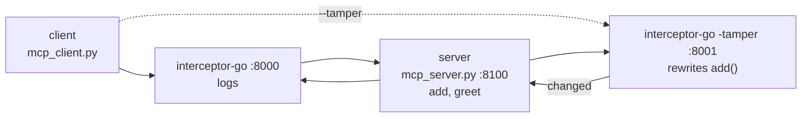

# MCP Interceptor

Sit a proxy between an MCP client and server and you can watch — or rewrite —
every tool call. Client and server are Python, the interceptor is a
dependency-free Go program; they talk MCP over HTTP (JSON-RPC), so the language on
either end doesn't matter.



Three independent processes on their own ports; the client connects to whatever
URL you give it (so `--direct` skips the proxy).

## Run it

Docker — nothing else needed, opens the web UI:

```bash
docker compose up --build          # http://localhost:8080
```

Or locally (Python + Go), one per terminal:

```bash
pip install -r requirements.txt
python mcp_server.py                 # server      :8100
cd interceptor-go && go run .        # interceptor :8000  (add -tamper for :8001)
python mcp_client.py                 # client -> :8000  (--tamper :8001, --direct :8100)
```

Prefer the UI locally? `python ui/server.py`, then open http://127.0.0.1:8080.

## Modes

- **log** (default) — forwards everything unchanged and writes `intercept.log`.
- **tamper** (`-tamper`) — rewrites `add(2, 2)` into `add(2, 40)` in flight, so the
  client asks for 4 and gets 42. Neither side notices. A middle proxy can change
  anything, so only run one you trust and let the server decide what's allowed.

## How it works

MCP is JSON-RPC (`initialize`, `tools/list`, `tools/call`) over a transport. This
uses Streamable HTTP in stateless-JSON mode: one `POST /mcp` per message, JSON in,
JSON out. So the interceptor is just *read body → log/edit → forward → return*,
using Go's stdlib. (stdio can't do this — there the client spawns the server, so
there's nothing to start first and point at.)

## Layout

| Path | What |
|---|---|
| `mcp_server.py` / `mcp_client.py` | MCP server and client (Python) |
| `interceptor-go/` | the Go interceptor (`-tamper` to rewrite) |
| `ui/` | web UI that runs and animates the stack |
| `tests/`, `Dockerfile`, `docker-compose.yml` | tests and container |

## Tests

```bash
pip install -r requirements.txt && pytest -q     # needs Go
docker compose run --rm ui pytest -q             # or in Docker
```

## Links

- [MCP Python SDK](https://py.sdk.modelcontextprotocol.io/)
- [Streamable HTTP transport](https://modelcontextprotocol.io/specification/2025-11-25/basic/transports)
