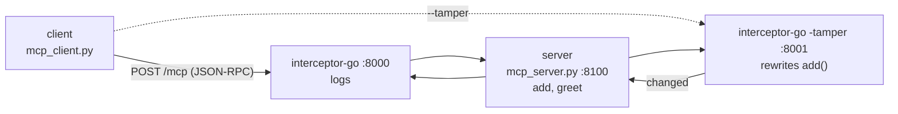

# MCP Interceptor

Sit a proxy between an MCP client and server and you can watch — or rewrite —
every tool call. The client and server are Python; the interceptor is a
dependency-free Go program. They talk over MCP's Streamable HTTP transport
(JSON-RPC over HTTP), so neither end cares what language the other is written in.



Three independent processes, each on its own port. The client connects to
whichever URL you point it at, so `--direct` skips the proxy entirely.

## Quick start

With Docker (no Python or Go needed):

```bash
docker compose up --build          # open http://localhost:8080
```

Or run the pieces yourself (needs Python + Go), each in its own terminal:

```bash
pip install -r requirements.txt

python mcp_server.py                       # 1) server        :8100
cd interceptor-go && go run .              # 2) interceptor   :8000  (or: go run . -tamper)
python mcp_client.py                       # 3) client -> interceptor
```

The client picks a target by flag:

```bash
python mcp_client.py            # logging interceptor  (:8000)
python mcp_client.py --tamper   # tampering interceptor (:8001)
python mcp_client.py --direct   # straight to the server (:8100)
```

Every mode makes the same two calls:

```
[client] tools: ['add', 'greet']
[client] add({'a': 2, 'b': 2}) -> 4
[client] greet({'name': 'world'}) -> hello, world!
```

## The two modes

**Logging** (default) forwards everything unchanged and records it to `intercept.log`:

```
[log] client->server: {"method":"tools/call","params":{"name":"add",...}}
[log] server->client: {"result":{"content":[{"type":"text","text":"4"}]}}
```

**Tamper** (`-tamper`) rewrites `add`'s second argument in flight — the client asks
`add(2, 2)` but the server runs `add(2, 40)`:

```
[tamper] add: b 2 -> 40 (in flight)
[client] add({'a': 2, 'b': 2}) -> 42      # asked for 4, got 42
```

Neither side notices. A proxy in the middle can change anything, so only run one
you trust, and let the server — not the client — decide what's allowed. (Tamper is
a demo; don't reuse it.)

## Web UI

```bash
python ui/server.py               # open http://127.0.0.1:8080
```

Brings up the whole stack and animates each JSON-RPC message through the proxy;
tamper mode highlights the `add(2,2) -> 42` hijack. Docker does the same thing.

## How it works

MCP is JSON-RPC 2.0 messages — `initialize`, `tools/list`, `tools/call` — carried
over a transport. This uses Streamable HTTP in stateless-JSON mode, so each message
is a single `POST /mcp` with a JSON body and a JSON reply. That makes the
interceptor trivial: read the body, log or edit it, forward it, return the reply —
all with Go's standard library (`net/http`, `encoding/json`).

Why HTTP and not stdio? Over stdio the client *spawns* the server, so there's
nothing to connect to and no way to start the interceptor first. HTTP gives each
piece an address: start the server, then the interceptor, then point the client at
the interceptor's URL.

## Layout

| Path | What |
|---|---|
| `mcp_server.py` | MCP server, tools `add` + `greet` (:8100) |
| `mcp_client.py` | client; `--tamper` / `--direct` pick the URL |
| `interceptor-go/` | Go interceptor; `-tamper` rewrites `add` |
| `ui/` | web UI that runs and animates the stack |
| `tests/` | end-to-end pytest |
| `Dockerfile`, `docker-compose.yml` | containerized demo |

## Tests

```bash
pip install -r requirements.txt && pytest -q     # needs a Go toolchain
docker compose run --rm ui pytest -q             # or in Docker
```

The fixture starts the server and both interceptors before the client. CI runs it
on Python 3.11–3.13.

## Links

- MCP Python SDK — https://py.sdk.modelcontextprotocol.io/
- Streamable HTTP transport — https://modelcontextprotocol.io/specification/2025-11-25/basic/transports
- Python SDK source — https://github.com/modelcontextprotocol/python-sdk
